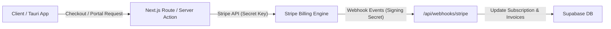

# Stripe Integration & Workflow Skill

This skill defines the development workflows, API conventions, and best practices for integrating Stripe in **Pensionsmanager** (Next.js, Tauri, Supabase).

---

## 1. Official Documentation & Resources

- **Official Docs**: [https://docs.stripe.com](https://docs.stripe.com)
- **Stripe API Reference**: [https://docs.stripe.com/api](https://docs.stripe.com/api)
- **Stripe MCP Server**: [https://docs.stripe.com/mcp](https://docs.stripe.com/mcp)
- **Stripe CLI**: [https://docs.stripe.com/stripe-cli](https://docs.stripe.com/stripe-cli)

---

## 2. Architecture in Pensionsmanager



### Key Components

1. **Stripe Checkout**:
   - Hosted payment pages for acquiring new subscriptions (e.g., Basis, Pro, Enterprise, Addon Modules).
   - Create checkout sessions server-side using `stripe.checkout.sessions.create()`.
   - Always pass `customer_email` / `customer_id` and metadata (`user_id`, `plan_id`).

2. **Stripe Customer Portal**:
   - Self-service portal for customers to manage payment methods, upgrade/downgrade plans, download VAT invoices, and cancel subscriptions.
   - Generated via `stripe.billingPortal.sessions.create({ customer: customerId, return_url: ... })`.

3. **Stripe Webhooks**:
   - Webhook endpoint: `/api/webhooks/stripe`.
   - **Crucial**: Always verify the event signature with `stripe.webhooks.constructEvent(body, signature, webhookSecret)`.
   - Process events idempotently to handle duplicate delivery.

---

## 3. Essential Webhook Events to Handle

| Event | Action in System |
| :--- | :--- |
| `checkout.session.completed` | Provision access, link Stripe `customerId` to Supabase user, activate subscription. |
| `customer.subscription.updated` | Update tier, seats, status (`active`, `past_due`, `canceled`), current period ends. |
| `customer.subscription.deleted` | Downgrade user account or revoke active subscription features. |
| `invoice.payment_succeeded` | Log successful payment record, reset failed retry counters. |
| `invoice.payment_failed` | Notify user of payment failure, set warning banner in account. |

---

## 4. Stripe CLI Development & Testing

When testing Stripe integrations and webhooks locally:

```bash
# 1. Login to Stripe account
stripe login

# 2. Forward webhooks to local Next.js dev server
stripe listen --forward-to localhost:3000/api/webhooks/stripe

# 3. Trigger test events in separate terminal
stripe trigger checkout.session.completed
stripe trigger customer.subscription.updated
stripe trigger invoice.payment_failed
```

---

## 5. Security & Best Practices

- **Never expose Secret Keys** (`sk_live_...`, `sk_test_...`) in client-side code or Git repositories.
- Only publishable keys (`pk_live_...`, `pk_test_...`) are permitted on the frontend.
- Store sensitive credentials in `.env.local` or Supabase Secrets Vault:
  - `STRIPE_SECRET_KEY`
  - `STRIPE_PUBLISHABLE_KEY`
  - `STRIPE_WEBHOOK_SECRET`
- **Idempotency**: Use `idempotencyKey` when creating charges or executing mutating actions to prevent double billing during network retries.
