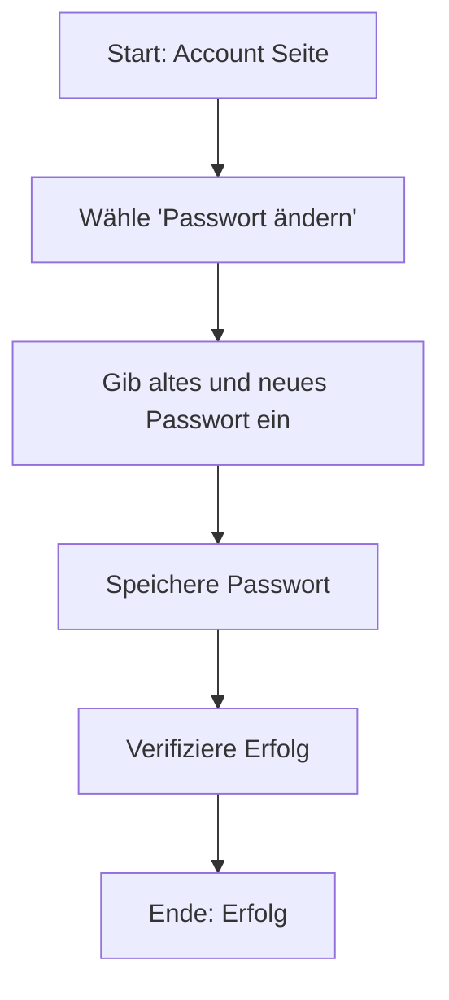

# Use Case: Change Password

Dieser Use Case beschreibt das Ändern des Benutzerpassworts.

## Klickstrecke (Mermaid.js)

```mermaid
flowchart TD
    A[Start: Account Seite] --> B[Wähle 'Passwort ändern']
    B --> C[Gib altes und neues Passwort ein]
    C --> D[Speichere Passwort]
    D --> E[Verifiziere Erfolg]
    E --> F[Ende: Erfolg]
```
