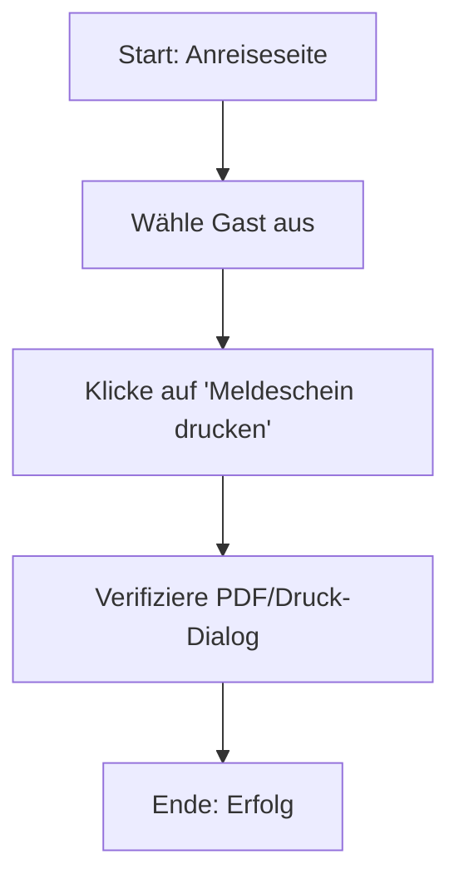

# Use Case: Print Registration Form

Dieser Use Case beschreibt das Ausdrucken (oder Generieren) des Meldescheins für einen anreisenden Gast.

## Klickstrecke (Mermaid.js)

```mermaid
flowchart TD
    A[Start: Anreiseseite] --> B[Wähle Gast aus]
    B --> C[Klicke auf 'Meldeschein drucken']
    C --> D[Verifiziere PDF/Druck-Dialog]
    D --> E[Ende: Erfolg]
```
