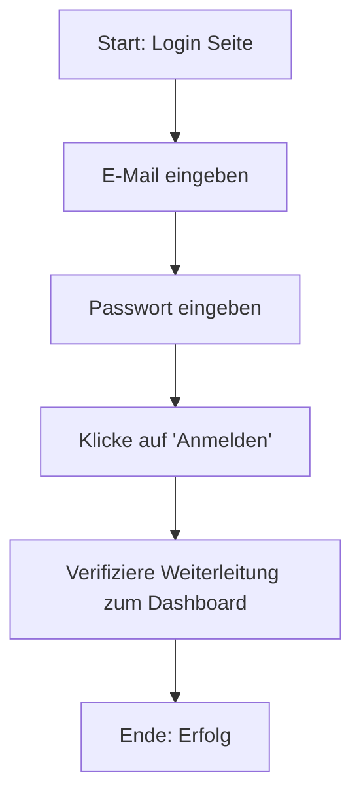

# Use Case: Login Success

Dieser Use Case beschreibt den erfolgreichen Login eines Benutzers mit gültigen Anmeldedaten.

## Klickstrecke (Mermaid.js)

```mermaid
flowchart TD
    A[Start: Login Seite] --> B[E-Mail eingeben]
    B --> C[Passwort eingeben]
    C --> D[Klicke auf 'Anmelden']
    D --> E[Verifiziere Weiterleitung zum Dashboard]
    E --> F[Ende: Erfolg]
```
