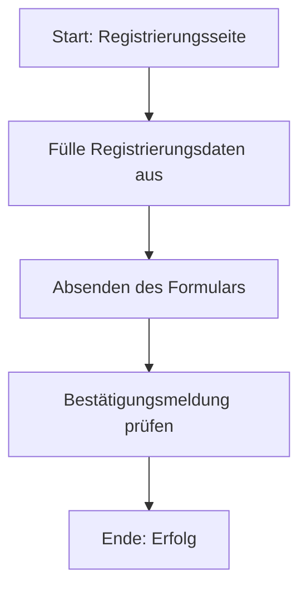

# Use Case: Registration Flow

Dieser Use Case beschreibt den Registrierungsprozess eines neuen Benutzers.

## Klickstrecke (Mermaid.js)

```mermaid
flowchart TD
    A[Start: Registrierungsseite] --> B[Fülle Registrierungsdaten aus]
    B --> C[Absenden des Formulars]
    C --> D[Bestätigungsmeldung prüfen]
    D --> E[Ende: Erfolg]
```
