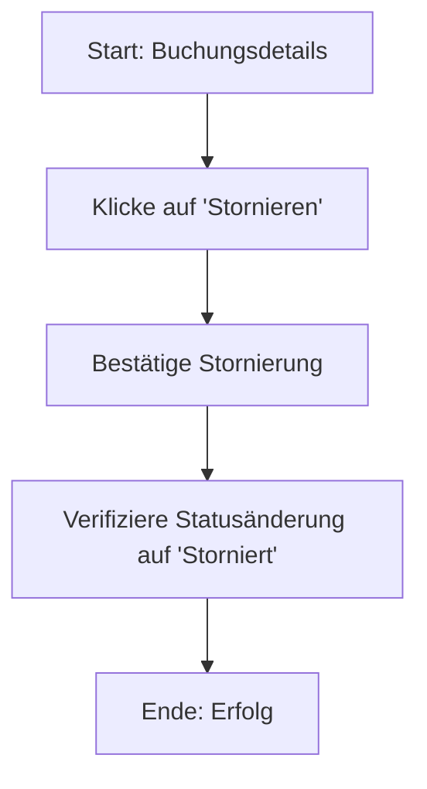

# Use Case: Cancel Booking

Dieser Use Case beschreibt das Stornieren einer bestehenden Buchung.

## Klickstrecke (Mermaid.js)

```mermaid
flowchart TD
    A[Start: Buchungsdetails] --> B[Klicke auf 'Stornieren']
    B --> C[Bestätige Stornierung]
    C --> D[Verifiziere Statusänderung auf 'Storniert']
    D --> E[Ende: Erfolg]
```
