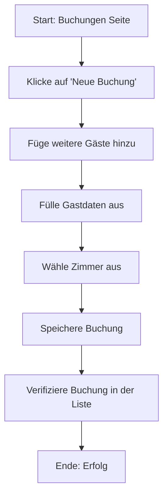

# Use Case: Gruppenbuchung erstellen

Dieser Use Case beschreibt den Prozess der Erstellung einer neuen Gruppenbuchung für mehrere Gäste.

## Klickstrecke (Mermaid.js)

```mermaid
flowchart TD
    A[Start: Buchungen Seite] --> B[Klicke auf 'Neue Buchung']
    B --> C[Füge weitere Gäste hinzu]
    C --> D[Fülle Gastdaten aus]
    D --> E[Wähle Zimmer aus]
    E --> F[Speichere Buchung]
    F --> G[Verifiziere Buchung in der Liste]
    G --> H[Ende: Erfolg]
```
