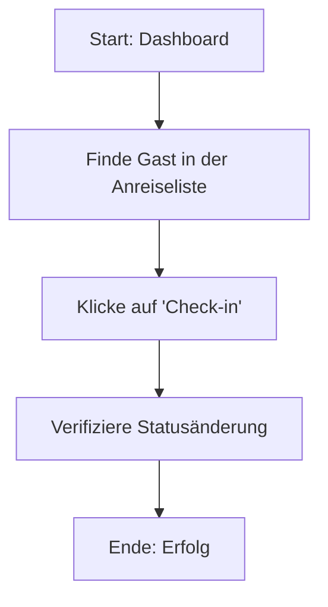

# Use Case: Quick Check-in

Dieser Use Case beschreibt den Schnell-Check-in eines erwarteten Gastes direkt vom Dashboard.

## Klickstrecke (Mermaid.js)

```mermaid
flowchart TD
    A[Start: Dashboard] --> B[Finde Gast in der Anreiseliste]
    B --> C[Klicke auf 'Check-in']
    C --> D[Verifiziere Statusänderung]
    D --> E[Ende: Erfolg]
```
