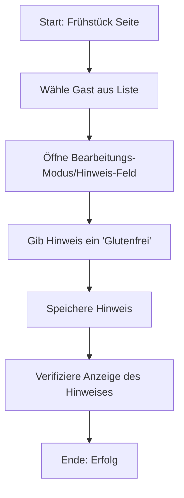

# Use Case: Hinweise hinzufügen

Dieser Use Case beschreibt das Hinzufügen von spezifischen Hinweisen (z.B. Allergien) zu einem Frühstücksgast.

## Klickstrecke (Mermaid.js)

```mermaid
flowchart TD
    A[Start: Frühstück Seite] --> B[Wähle Gast aus Liste]
    B --> C[Öffne Bearbeitungs-Modus/Hinweis-Feld]
    C --> D[Gib Hinweis ein 'Glutenfrei']
    D --> E[Speichere Hinweis]
    E --> F[Verifiziere Anzeige des Hinweises]
    F --> G[Ende: Erfolg]
```
