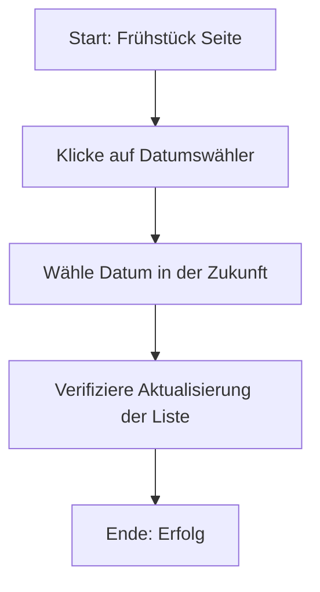

# Use Case: Timetravel auf anderes Datum

Dieser Use Case beschreibt das Wechseln der Ansicht auf einen zukünftigen oder vergangenen Frühstückstag.

## Klickstrecke (Mermaid.js)

```mermaid
flowchart TD
    A[Start: Frühstück Seite] --> B[Klicke auf Datumswähler]
    B --> C[Wähle Datum in der Zukunft]
    C --> D[Verifiziere Aktualisierung der Liste]
    D --> E[Ende: Erfolg]
```
