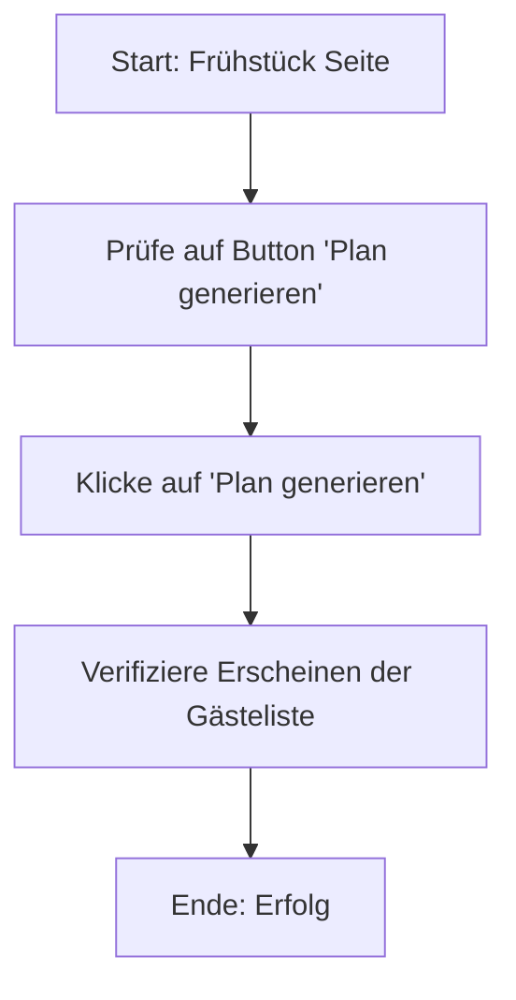

# Use Case: Plan generieren

Dieser Use Case beschreibt das automatische Generieren des Frühstücksplans für den aktuellen Tag.

## Klickstrecke (Mermaid.js)

```mermaid
flowchart TD
    A[Start: Frühstück Seite] --> B[Prüfe auf Button 'Plan generieren']
    B --> C[Klicke auf 'Plan generieren']
    C --> D[Verifiziere Erscheinen der Gästeliste]
    D --> E[Ende: Erfolg]
```
