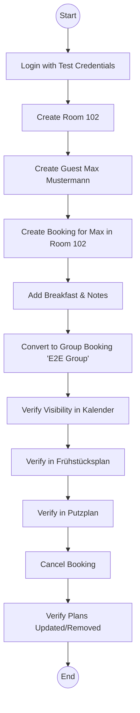

# Use Case: Full Lifecycle Journey

This test verifies the complete lifecycle of a booking, from room/guest creation to cancellation, ensuring all dependent plans are updated.

```mermaid
graph TD
    Start((Start)) --> Login[Login with Test Credentials]
    Login --> CreateRoom[Create Room 102]
    CreateRoom --> CreateGuest[Create Guest Max Mustermann]
    CreateGuest --> CreateBooking[Create Booking for Max in Room 102]
    CreateBooking --> AddDetails[Add Breakfast & Notes]
    AddDetails --> ConvertGroup[Convert to Group Booking 'E2E Group']
    ConvertGroup --> VerifyCalendar[Verify Visibility in Kalender]
    VerifyCalendar --> VerifyBreakfast[Verify in Frühstücksplan]
    VerifyBreakfast --> VerifyCleaning[Verify in Putzplan]
    VerifyCleaning --> CancelBooking[Cancel Booking]
    CancelBooking --> VerifyPlansRemoved[Verify Plans Updated/Removed]
    VerifyPlansRemoved --> End((End))
```
