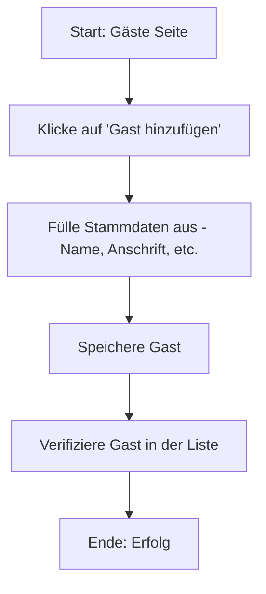

# Use Case: Gast manuell anlegen

Dieser Use Case beschreibt das manuelle Anlegen eines neuen Gast-Stammdatensatzes.

## Klickstrecke (Mermaid.js)

```mermaid
flowchart TD
    A[Start: Gäste Seite] --> B[Klicke auf 'Gast hinzufügen']
    B --> C[Fülle Stammdaten aus - Name, Anschrift, etc.]
    C --> D[Speichere Gast]
    D --> E[Verifiziere Gast in der Liste]
    E --> F[Ende: Erfolg]
```
