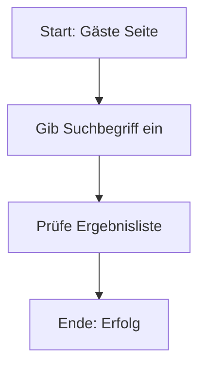

# Use Case: Search Guest

Dieser Use Case beschreibt die Suche nach einem Gast in der Stammdatenliste.

## Klickstrecke (Mermaid.js)

```mermaid
flowchart TD
    A[Start: Gäste Seite] --> B[Gib Suchbegriff ein]
    B --> C[Prüfe Ergebnisliste]
    C --> D[Ende: Erfolg]
```
