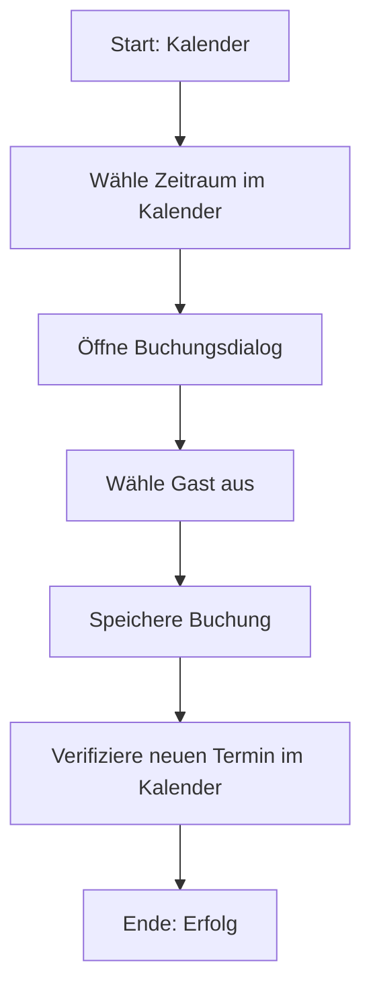

# Use Case: Create Quick Booking

Dieser Use Case beschreibt das Erstellen einer Schnellbuchung direkt im Kalender durch Auswahl eines Zeitraums.

## Klickstrecke (Mermaid.js)

```mermaid
flowchart TD
    A[Start: Kalender] --> B[Wähle Zeitraum im Kalender]
    B --> C[Öffne Buchungsdialog]
    C --> D[Wähle Gast aus]
    D --> E[Speichere Buchung]
    E --> F[Verifiziere neuen Termin im Kalender]
    F --> G[Ende: Erfolg]
```
