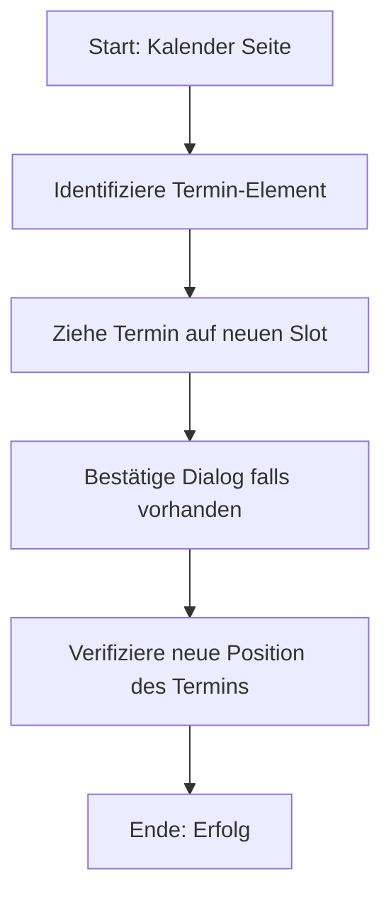

# Use Case: Termin verschieben (Drag-and-Drop)

Dieser Use Case beschreibt das Verschieben eines bestehenden Termins im Kalender auf ein anderes Datum oder Zimmer mittels Drag-and-Drop.

## Klickstrecke (Mermaid.js)

