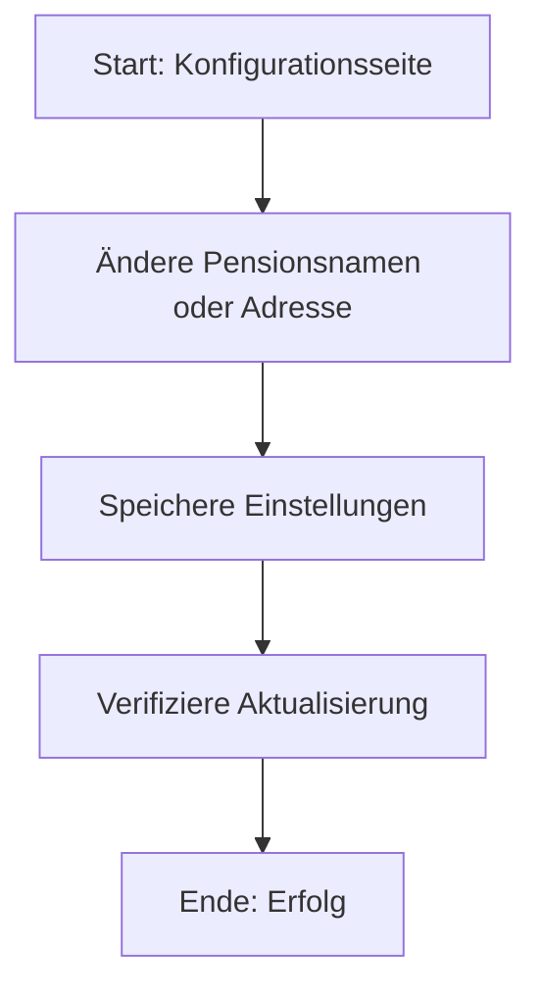

# Use Case: Pension Settings

Dieser Use Case beschreibt das Aktualisieren der allgemeinen Pensions-Stammdaten in der Konfiguration.

## Klickstrecke (Mermaid.js)

```mermaid
flowchart TD
    A[Start: Konfigurationsseite] --> B[Ändere Pensionsnamen oder Adresse]
    B --> C[Speichere Einstellungen]
    C --> D[Verifiziere Aktualisierung]
    D --> E[Ende: Erfolg]
```
