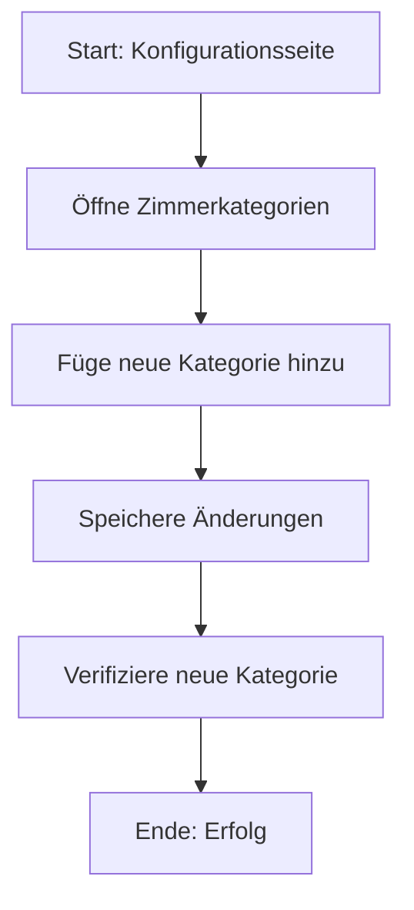

# Use Case: Room Categories

Dieser Use Case beschreibt das Verwalten von Zimmerkategorien.

## Klickstrecke (Mermaid.js)

```mermaid
flowchart TD
    A[Start: Konfigurationsseite] --> B[Öffne Zimmerkategorien]
    B --> C[Füge neue Kategorie hinzu]
    C --> D[Speichere Änderungen]
    D --> E[Verifiziere neue Kategorie]
    E --> F[Ende: Erfolg]
```
