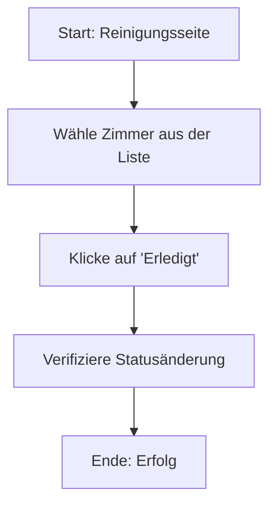

# Use Case: Mark Room Cleaned

Dieser Use Case beschreibt das Markieren eines Zimmers als 'Gereinigt'.

## Klickstrecke (Mermaid.js)

```mermaid
flowchart TD
    A[Start: Reinigungsseite] --> B[Wähle Zimmer aus der Liste]
    B --> C[Klicke auf 'Erledigt']
    C --> D[Verifiziere Statusänderung]
    D --> E[Ende: Erfolg]
```
