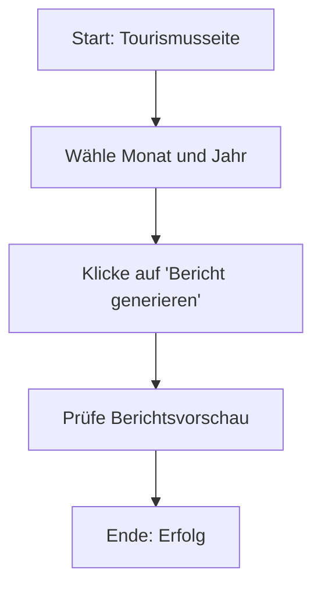

# Use Case: Monthly Report

Dieser Use Case beschreibt das Erstellen und Einsehen des monatlichen Tourismusberichts.

## Klickstrecke (Mermaid.js)

```mermaid
flowchart TD
    A[Start: Tourismusseite] --> B[Wähle Monat und Jahr]
    B --> C[Klicke auf 'Bericht generieren']
    C --> D[Prüfe Berichtsvorschau]
    D --> E[Ende: Erfolg]
```
