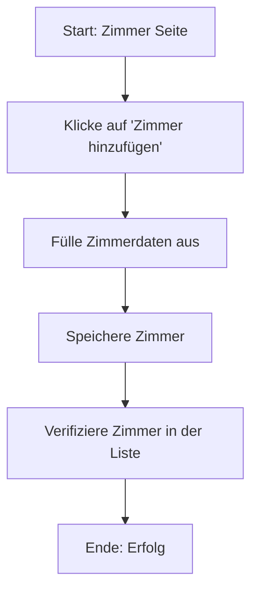

# Use Case: Create Room

Dieser Use Case beschreibt das Anlegen eines neuen Zimmers in der Konfiguration.

## Klickstrecke (Mermaid.js)

```mermaid
flowchart TD
    A[Start: Zimmer Seite] --> B[Klicke auf 'Zimmer hinzufügen']
    B --> C[Fülle Zimmerdaten aus]
    C --> D[Speichere Zimmer]
    D --> E[Verifiziere Zimmer in der Liste]
    E --> F[Ende: Erfolg]
```
