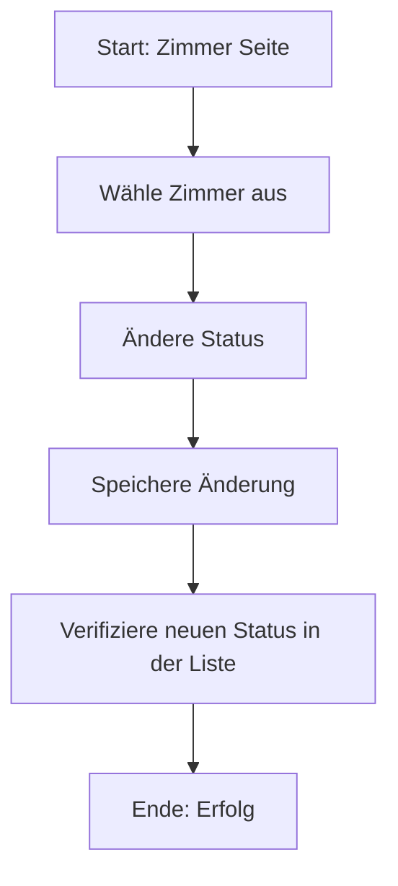

# Use Case: Update Room Status

Dieser Use Case beschreibt die Änderung des Status eines Zimmers (z.B. Außer Betrieb).

## Klickstrecke (Mermaid.js)

```mermaid
flowchart TD
    A[Start: Zimmer Seite] --> B[Wähle Zimmer aus]
    B --> C[Ändere Status]
    C --> D[Speichere Änderung]
    D --> E[Verifiziere neuen Status in der Liste]
    E --> F[Ende: Erfolg]
```
